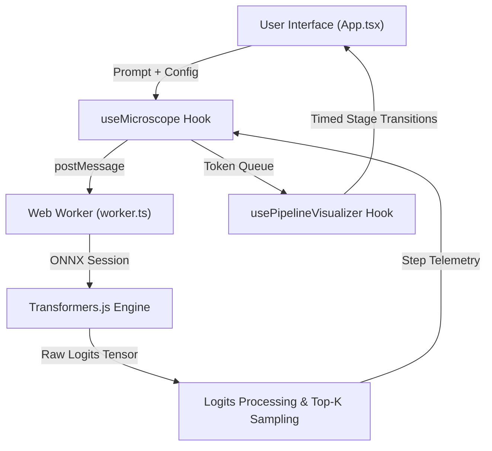

# Architecture & Dataflow

## System Architecture

## Inference Loop & Protocol
1. **Prompt Injection / Formatting**: For instruction-tuned models (e.g., `LaMini-GPT-124M`), raw prompts are wrapped into instruction templates (`### Instruction:` / `### Response:`).
2. **Autoregressive Loop in Worker**:
   - `model({ input_ids, attention_mask })` forward pass.
   - Logits extraction for the terminal sequence token.
   - Temperature scaling (`/= temperature`).
   - Softmax normalization across the full 50,257 vocabulary.
   - Top-K candidate extraction (top 40 pool, top 5 telemetry to UI).
   - Weighted random sampling from the top-K probability distribution.
   - Autoregressive tensor concatenation: `new Tensor('int64', new_input_data, [1, seq_len])`.
3. **Pipeline Visualizer State Machine**:
   - Cycles through stages: `inference` -> `logits` -> `prob_receive` -> `selection` -> `append`.
   - Regulates playback speed (`0.25x`, `0.5x`, `1x`, `2x`, `LIVE`).
