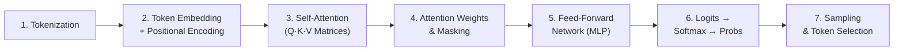

# LLM Microscope v2 — Complete Rebuild Plan

> **Goal**: Transform the LLM Microscope from a basic generation dashboard into a world-class, step-by-step interactive educational tool that visually teaches how a Transformer-based LLM actually works — from raw text input all the way to the final predicted token.

> [!IMPORTANT]
> **Phase 1: Mock Data First.** Every visualization will be powered by hardcoded, mathematically correct mock data. No real model required. This lets us build fast, iterate on UX, and validate the educational flow before integrating a live model.

---

## 🧠 What We're Teaching (The Transformer Pipeline)

The site will walk users through the **7 stages** that happen inside a Transformer every time it predicts the next token. Each stage gets its own dedicated visual section on a single scrollable page:



| Stage | What the User Sees | What They Learn |
|:---|:---|:---|
| **1. Tokenization** | Their input text split into colored subword chunks with token IDs | Text isn't processed as words; BPE splits it into subwords |
| **2. Embedding + Position** | Each token mapped to a vector (mini heatmap), then added to positional vectors | Tokens become numbers; position matters |
| **3. Self-Attention (QKV)** | Animated matrix multiplications: input → Q, K, V matrices with visible weights | How the model "decides what to look at" |
| **4. Attention Heatmap** | Interactive NxN attention grid showing which tokens attend to which | The core insight: context is relational |
| **5. Feed-Forward (MLP)** | Animated neuron layers with ReLU activation visualization | Non-linear transformation adds "thinking" |
| **6. Logits → Softmax → Probabilities** | Raw logit scores → animated softmax curve → probability bars for top-K tokens | How raw numbers become percentages |
| **7. Sampling & Selection** | Temperature slider, top-k/top-p visualization, dice roll animation | Why the same prompt gives different outputs |

---

## 📐 Architecture: Page Structure

**Single-page scrollable app** with a fixed input bar at the top. Each stage is a full-width section that activates as the user scrolls or clicks "Next Step".

```
┌─────────────────────────────────────────────────┐
│  HEADER: LLM Microscope · [Model Badge] · Mode  │
├─────────────────────────────────────────────────┤
│  INPUT BAR: "The cat sat on the" [▶ Run]        │
│  ↕ Mode toggle: [Step-by-Step] / [Auto-Play]    │
├─────────────────────────────────────────────────┤
│                                                  │
│  ┌─ STAGE 1: TOKENIZATION ────────────────────┐ │
│  │  "The" "cat" "sat" "on" "the"              │ │
│  │   [464]  [2857] [3332] [319] [262]         │ │
│  │  Explainer card: "BPE splits text..."      │ │
│  └────────────────────────────────────────────┘ │
│                                                  │
│  ┌─ STAGE 2: EMBEDDING LOOKUP ────────────────┐ │
│  │  Token "cat" → [0.12, -0.54, 0.87, ...]   │ │
│  │  Positional  → [0.01,  0.99, 0.02, ...]   │ │
│  │  Combined    → [0.13,  0.45, 0.89, ...]   │ │
│  │  ▸ Heatmap visualization of the vector     │ │
│  └────────────────────────────────────────────┘ │
│                                                  │
│  ┌─ STAGE 3: SELF-ATTENTION (QKV) ───────────┐ │
│  │  ┌──────┐   ┌──────┐   ┌──────┐          │ │
│  │  │  Q   │ × │  K^T │ = │ Score│          │ │
│  │  └──────┘   └──────┘   └──────┘          │ │
│  │  Animated matrix multiply with numbers     │ │
│  └────────────────────────────────────────────┘ │
│                                                  │
│  ┌─ STAGE 4: ATTENTION HEATMAP ───────────────┐ │
│  │      The  cat  sat   on  the               │ │
│  │  The [██] [░░] [░░] [░░] [░░]              │ │
│  │  cat [░░] [██] [▓▓] [░░] [░░]              │ │
│  │  sat [░░] [▓▓] [██] [▓▓] [░░]              │ │
│  │  Interactive: click a cell to see score     │ │
│  └────────────────────────────────────────────┘ │
│                                                  │
│  ┌─ STAGE 5: FEED-FORWARD NETWORK ───────────┐ │
│  │  [neuron]→[ReLU]→[neuron]→[output]        │ │
│  │  Animated signal propagation               │ │
│  └────────────────────────────────────────────┘ │
│                                                  │
│  ┌─ STAGE 6: LOGITS → SOFTMAX → PROBS ───────┐ │
│  │  Raw: [3.2, 1.1, -0.5, 7.8, ...]          │ │
│  │  ──── softmax() ────→                       │ │
│  │  Probs: [2.1%, 0.3%, 0.1%, 89.2%, ...]    │ │
│  │  Animated bar chart of top-10 candidates    │ │
│  └────────────────────────────────────────────┘ │
│                                                  │
│  ┌─ STAGE 7: SAMPLING & OUTPUT ───────────────┐ │
│  │  Temperature: [====●=====] 0.7             │ │
│  │  Top-K: 40 ·  Top-P: 0.9                  │ │
│  │  Selected: " mat" (89.2%) 🎲               │ │
│  │  → "The cat sat on the mat"                │ │
│  └────────────────────────────────────────────┘ │
│                                                  │
└─────────────────────────────────────────────────┘
```

---

## 📁 New File Structure

```
src/
├── App.tsx                          # Layout shell: header, input bar, stage renderer
├── main.tsx                         # React root
├── index.css                        # Tailwind + custom styles
├── worker.ts                        # (Preserved for Phase 2 model integration)
│
├── data/
│   └── mockPipeline.ts              # All mock data for the 7 stages
│
├── hooks/
│   ├── useMicroscope.ts             # (Preserved, used in Phase 2)
│   ├── usePipelineVisualizer.ts     # (Preserved, used in Phase 2)
│   └── useStageController.ts        # NEW: step-by-step / auto-play state machine
│
├── components/
│   ├── InputBar.tsx                  # Prompt input + Run button + mode toggle
│   ├── StageHeader.tsx               # Reusable stage number + title + explainer
│   ├── ExplainerCard.tsx             # Collapsible "How it works" sidebar
│   │
│   ├── stages/
│   │   ├── TokenizationStage.tsx     # Stage 1: BPE tokenizer visualization
│   │   ├── EmbeddingStage.tsx        # Stage 2: Embedding lookup + positional encoding
│   │   ├── AttentionQKVStage.tsx     # Stage 3: Q, K, V matrix computation
│   │   ├── AttentionHeatmapStage.tsx # Stage 4: Attention weights heatmap
│   │   ├── FeedForwardStage.tsx      # Stage 5: MLP / FFN visualization
│   │   ├── SoftmaxStage.tsx          # Stage 6: Logits → Softmax → Probabilities
│   │   └── SamplingStage.tsx         # Stage 7: Temperature, Top-K, selection
│   │
│   └── visualizations/
│       ├── MatrixGrid.tsx            # Reusable animated matrix (for embeddings, QKV)
│       ├── HeatmapGrid.tsx           # NxN attention heatmap
│       ├── VectorBar.tsx             # Single embedding vector heatmap row
│       ├── NeuronGraph.tsx           # Animated neuron network (upgraded from current)
│       ├── ProbabilityBars.tsx        # Horizontal prob bars with labels
│       └── SoftmaxCurve.tsx          # Animated softmax transformation curve
│
└── types/
    └── index.ts                      # Updated types for all stage data
```

---

## 🔨 Implementation Phases

### Phase 1: Foundation (Sessions 1–2)
- [ ] **1.1** Create `data/mockPipeline.ts` with hardcoded data for the sentence "The cat sat on the"
- [ ] **1.2** Create `useStageController.ts` hook (current stage index, next/prev/auto-play, speed)
- [ ] **1.3** Create `InputBar.tsx`, `StageHeader.tsx`, `ExplainerCard.tsx` shell components
- [ ] **1.4** Rewrite `App.tsx` as the stage layout shell (vertical scroll of stages)

### Phase 2: Tokenization + Embedding Stages (Session 3)
- [ ] **2.1** Build `TokenizationStage.tsx` — animated BPE splitting with color-coded tokens
- [ ] **2.2** Build `EmbeddingStage.tsx` — vector lookup table + positional encoding addition
- [ ] **2.3** Build `MatrixGrid.tsx` and `VectorBar.tsx` reusable visualizations

### Phase 3: Attention Mechanism (Sessions 4–5)
- [ ] **3.1** Build `AttentionQKVStage.tsx` — animated matrix multiplication (Q = input × W_Q)
- [ ] **3.2** Build `AttentionHeatmapStage.tsx` — interactive NxN attention grid
- [ ] **3.3** Build `HeatmapGrid.tsx` reusable component

### Phase 4: FFN + Output Stages (Session 6)
- [ ] **4.1** Build `FeedForwardStage.tsx` — upgraded NeuronGraph with ReLU animation
- [ ] **4.2** Build `SoftmaxStage.tsx` — raw logits → softmax curve → probability bars
- [ ] **4.3** Build `SamplingStage.tsx` — temperature slider, top-k, dice roll, final token
- [ ] **4.4** Build `ProbabilityBars.tsx` and `SoftmaxCurve.tsx`

### Phase 5: Polish & Integration (Session 7)
- [ ] **5.1** Add explainer cards to every stage with collapsible "How it works" text
- [ ] **5.2** Add smooth scroll navigation + stage progress indicator
- [ ] **5.3** Add responsive design for tablet/mobile
- [ ] **5.4** Wire up the real model (Phase 2 of the overall project)

---

## 🎨 Design Principles

1. **Dark Observatory Aesthetic** — Keep the current `#0C0C0C` background with emerald accents. This is a scientific instrument, not a dashboard.
2. **Show Real Numbers** — Every matrix cell, every probability, every embedding dimension shows an actual (mock) number. No abstract blobs.
3. **Progressive Disclosure** — Each stage starts collapsed with a 1-line summary. Click to expand the full visualization. Explainer cards are collapsible sidebars.
4. **Physics-Based Motion** — All transitions use Framer Motion springs. Matrices animate cell-by-cell. Tokens slide into place.
5. **Contrast** — All text ≥ `#A0A0A0` on dark backgrounds. Active elements use `white` or `emerald-400`.

---

## 📊 Mock Data Specification (for "The cat sat on the")

```typescript
// Token IDs (GPT-2 BPE)
tokens: ["The", " cat", " sat", " on", " the"]
tokenIds: [464, 3797, 3332, 319, 262]

// Embedding vectors (d_model = 768, showing first 8 dims)
embeddings: [
  [0.12, -0.54, 0.87, 0.23, -0.91, 0.45, 0.67, -0.12, ...],  // "The"
  [0.45, 0.32, -0.78, 0.11, 0.56, -0.34, 0.89, 0.02, ...],   // " cat"
  ...
]

// Attention scores (5×5 matrix, post-softmax, causal masked)
attentionWeights: [
  [1.00, 0.00, 0.00, 0.00, 0.00],  // "The" only attends to itself
  [0.35, 0.65, 0.00, 0.00, 0.00],  // " cat" attends to "The" and itself
  [0.15, 0.40, 0.45, 0.00, 0.00],  // " sat" attends to all previous
  [0.10, 0.20, 0.30, 0.40, 0.00],  // " on"
  [0.05, 0.15, 0.20, 0.25, 0.35],  // " the"
]

// Top-10 logits for next token prediction
logits: [
  { token: " mat", logit: 7.83, probability: 0.421 },
  { token: " floor", logit: 6.21, probability: 0.089 },
  { token: " rug", logit: 5.94, probability: 0.068 },
  { token: " roof", logit: 5.71, probability: 0.054 },
  { token: " bed", logit: 5.55, probability: 0.044 },
  ...
]
```

---

> [!TIP]
> **How to proceed**: Say "start building" and I'll begin with Phase 1 (Foundation), creating the mock data, stage controller, and layout shell. Each phase will be followed by a build check before moving on.
