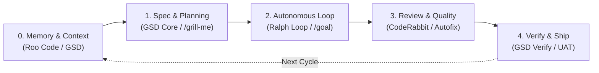

# AGENTS.md — Unified Agentic Engineering Playbook

> **Drop-in Agent Configuration**: Place this file at the root of any repository to activate an end-to-end autonomous engineering pipeline across **Antigravity**, **Claude Code**, **Roo Code**, **Cursor**, and other open-standard coding agents.

---

## 🧭 System Architecture & Skill Orchestration

This project utilizes 4 core skills and agentic abilities structured into a continuous lifecycle:



| Lifecycle Stage | Active Skill / Framework | Primary Function |
| :--- | :--- | :--- |
| **0. Context & Memory** | `roo-code` + `gsd-map-codebase` | Maintain persistent project memory and state across agent sessions |
| **1. Specification & Planning**| `gsd-plan-phase` + `gsd-discuss-phase` | Spec-driven task decomposition and architectural alignment before coding |
| **2. Autonomous Iteration** | `ralph-loop` (`ralph-loop-workflow`) | Continuous test-driven build-and-fix loop until all criteria pass |
| **3. Automated Code Review**| `code-review` (`coderabbit`) + `autofix` | Pre-commit AI diff review, security auditing, and automated autofix |
| **4. Verification & Handoff**| `gsd-verify-work` | User acceptance testing (UAT) and git milestone progression |

---

## ⚡ Agent Operational Directives

When interacting with this repository, AI agents **MUST** adhere to the following workflow:

### Phase 1: Context & Architectural Alignment (Before Writing Code)
1. **Check Memory Bank**: Inspect `.planning/` or root docs to understand established patterns, current phase, and dependencies.
2. **Decompose, Don't Guess**: For any non-trivial feature or bug fix:
   - Run `gsd-discuss-phase` or conduct an interactive clarification session (`/grill-me`) to eliminate ambiguous requirements.
   - Run `gsd-plan-phase` to break the requirement into an atomic, verifiable implementation plan (`PLAN.md`).
3. **Multi-Model / Role Separation**:
   - **Architect Mode**: Focus on requirements, data models, edge cases, and interfaces.
   - **Code Mode**: Produce clean, idiomatic, minimal-diff implementations.
   - **Debug Mode**: Isolate root cause with minimal reproduction before modifying code.

### Phase 2: Autonomous Implementation Loop (Ralph Loop)
1. **Preflight Check**:
   - Ensure local dev environment, linters, and test runners are operational.
2. **Autonomous Execution (`/goal`)**:
   - Work iteratively through the task checklist in `PLAN.md`.
   - After each discrete change:
     - Run existing test suite and lint checks.
     - Add new unit or integration tests demonstrating the fix/feature.
     - Never consider a task done until tests pass with exit code 0.
3. **Subagent Delegation**:
   - Offload extensive research, documentation searches, or parallel checks to isolated subagents to preserve context fidelity.

### Phase 3: Code Review & Quality Gate (CodeRabbit)
1. **Pre-Commit Review**:
   - Trigger `code-review` on git staged or uncommitted diffs before committing or finalizing a turn.
   - Triage all issues:
     - **Critical**: Security vulnerabilities, breaking API contracts, data loss risks. Must be resolved immediately.
     - **Warning**: Code smells, missing error handling, performance bottlenecks. Address before shipping.
     - **Info**: Stylistic consistency and minor documentation notes.
2. **Automated Fix Loop**:
   - Apply targeted fixes via `autofix` for issues raised during the review pass.

### Phase 4: Verification & Handoff (GSD Shipping)
1. **UAT & Sanity Check**:
   - Trigger `gsd-verify-work` to validate that acceptance criteria defined in Phase 1 are fully satisfied.
2. **Clean Milestone Commits**:
   - Commit changes with semantic commit messages referencing the completed task.
   - Update project memory / changelog.

---

## 🛠️ Quick Commands & Trigger Reference

### Slash Commands & Agent Abilities
- `/plan` — Generate a formal execution plan before starting complex multi-file work.
- `/grill-me` — Stress-test assumptions and interview the developer on edge cases before coding.
- `/goal` — Run autonomously in an end-to-end loop until all acceptance criteria and tests pass.
- `/boost` — Engage multi-perspective reasoning and rigorous verification for hard engineering problems.

### Skill Invocations
- **Initialize / Map Codebase**:
  ```bash
  # Map system architecture and tech stack
  invoke: gsd-map-codebase
  ```
- **Plan Next Milestone**:
  ```bash
  # Plan next phase tasks
  invoke: gsd-plan-phase
  ```
- **Autonomous Iteration Cycle**:
  ```bash
  # Kick off continuous test-driven loop
  invoke: ralph-loop
  ```
- **Run AI Code Review**:
  ```bash
  # Audit git diff
  invoke: code-review
  ```

---

## 📁 Recommended Repository Layout

```
.
├── AGENTS.md                  # This playbook (root instructions)
├── .planning/                 # GSD Core state and specs
│   ├── PROJECT.md             # Project vision, tech stack, and roadmap
│   ├── codebase/              # Codebase maps (architecture, patterns)
│   └── phases/                # Phase plans (PLAN.md, VERIFICATION.md)
├── .roomodes                  # Custom Roo Code role definitions (if applicable)
└── src/                       # Application source code
```
